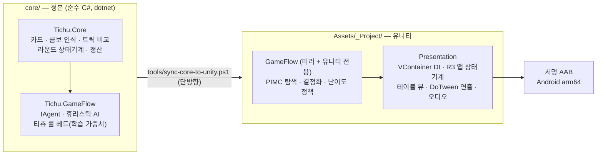

# Tichu Master

4인 팀 트릭테이킹 카드게임 **티츄**의 모바일(Android) 구현. 오프라인 AI 대전을 지원하며, Google Play 출시를 준비 중이다.

[](https://github.com/kas328/Tichu/actions/workflows/core-tests.yml)


-3DDC84?logo=android)

게임 규칙과 AI는 **유니티 타입을 단 하나도 참조하지 않는 순수 C#** 으로 작성돼 있다. 그래서 에디터 없이 `dotnet test` 로 325개 테스트가 5초에 돌고, CI가 푸시마다 이를 검증한다. 유니티는 그 위에서 표시와 연출만 맡는다.

---

## 이 저장소가 보여주는 것

| | 근거 |
|---|---|
| **엔진과 표현의 분리** | `Tichu.Core` 는 유니티 의존 0. 규칙 엔진을 10만 판 시뮬레이션으로 무결성 검증(점수 총합·카드 보존·상태 전이)한 뒤에야 화면을 붙였다. |
| **AI를 감이 아니라 측정으로** | 모든 강도 주장은 동일 딜을 양팀에 돌리는 **격리 미러드 벤치**로 판정한다. 라운드당 점수차와 Wilson 신뢰하한을 근거로만 채택한다. |
| **정직한 음성 결과** | 학습 가치망(−31.67점/R), reach-probability(효과 없음), 리드 휴리스틱 오버라이드(4~5회 회귀) — 실패한 실험을 지우지 않고 수치와 함께 남겼다. |
| **TDD** | 실패(RED)를 눈으로 확인한 뒤 구현한다. 커밋 메시지에 RED 관측값(`But was: Phoenix`)이 그대로 남아 있다. |
| **출시까지 가는 파이프라인** | 서명된 릴리스 AAB(IL2CPP·arm64·targetSdk 36) 산출, 실기 스모크 통과, 개인정보처리방침 게시, Play App content 24항목 확정. |

---

## 아키텍처



- **정본은 `core/`**, 유니티 쪽은 사본이다. 한 방향으로만 동기화하고, CI가 매 푸시마다 정본과 사본의 해시를 비교해 어긋남을 막는다.
- PIMC 탐색기(결정화 · 세계별 탐색 · 난이도 정책)는 **아직** 유니티 쪽 `GameFlow` 에만 있다. 코드 자체는 엔진 의존이 0이고(`Tichu.GameFlow.asmdef` 의 `noEngineReferences: true`), 런타임에 묶인 것은 예산과 취소를 감싸는 어댑터 `PimcDecisionAgent` 한 겹뿐이다 — 코어로 승격 가능한 남은 정리 대상이다. 그래서 PIMC 테스트 80개는 CI가 아니라 에디터 테스트에서만 돈다. 규칙과 휴리스틱은 양쪽이 같은 코드다.
- 앱 흐름은 **R3(Reactive Extensions) + 순수 reducer** 로 만든 상태기계다. 메뉴 → 난이도 선택 → 매치 → 결과가 전부 하나의 전이 함수로 표현되고, 씬은 Additive로 얹힌다.

---

## AI — PIMC (Perfect Information Monte Carlo)

티츄는 상대 손패를 모르는 **불완전 정보** 게임이다. 매 차례 관측 정보(공개된 카드, 콜 선언, 교환 기록)와 모순되지 않는 가상의 손패 분포를 N개 만들고(**결정화**), 각 세계에서 완전 정보 탐색을 돌린 뒤 기대값을 합산해 수를 고른다.

| 난이도 | 세계 수 | 탐색 예산 | 비고 |
|---|---|---|---|
| 쉬움 | — | — | 휴리스틱 단독 |
| 보통 | 16 | 900 ms | |
| 어려움 | 20 | 900 ms | |
| 전문가 | 24 | 900 ms | |

세계 수는 관전 연출 시간(카드가 날아가는 시간) 안에서 끝나도록 잡혀 있어 체감 지연이 없다. 탐색은 `anytime` 방식이라 예산이 끊기면 그 시점까지의 최선을 반환한다.

### 실험 방법론

강도 변경은 예외 없이 아래 절차를 거친다. 인간의 눈에 "낭비"로 보이는 수가 실제로는 최선인 경우가 반복해서 확인됐기 때문이다.

1. 현행 AI를 그대로 동결한 사본(`OldAiAgent`)을 만든다.
2. **같은 딜**을 양팀 자리를 바꿔 두 번 돌린다(미러드) — 카드 운을 상쇄한다.
3. 수천 라운드의 **쌍 평균**으로 라운드당 점수차와 신뢰구간을 낸다.
4. 부호가 배치 간에 안정적이고 회귀가 없을 때만 채택한다.

### 채택과 기각

| 변경 | 측정 | 판정 |
|---|---|---|
| PIMC vs 휴리스틱 (기준선) | +127점/R · 승률 69% · Wilson 하한 0.594 | **채택** |
| 엔드게임 셰딩 타이브레이크 | +34.3점/R · Wilson 하한 0.557 | **채택** |
| 상대 위협 블록 가드 | +16.9점/R | **채택** |
| 그랜드 티츄 콜 헤드 (학습 로지스틱) | +4.97점/R · 95% CI [2.25, 7.69] | **채택** |
| 스몰 티츄 콜 헤드 | +2.91점/R · 95% CI [2.16, 3.67] | **채택** |
| ε 정상화 (중복 롤아웃 제거) | 강도 중립 · **5.8배 가속** | **채택** |
| 합법수 생성 핫패스 최적화 | 호출당 할당 −91% · gen0 GC 0회 | **채택** |
| reach-probability 가중 | 16세계 2배치에서 부호 반전 | 기각 |
| α-μ 강건 백업 | 노이즈만 증가 | 보류(코드 보존) |
| 학습 가치망 리프 평가 | −31.67점/R · 승률 45% | **기각** |
| 리드 순서 휴리스틱 오버라이드 | 4~5회 연속 회귀 | 기각 |

수치의 출처는 각 실험 리포트에 있다 → [`docs/reports/ai-bench/`](docs/reports/ai-bench)

---

## 품질 게이트

| 게이트 | 범위 | 실행 |
|---|---|---|
| CI — 룰엔진 · 휴리스틱 AI · 콜 헤드 | 325 테스트 | 푸시마다 자동 (`dotnet test`, 5초) |
| CI — 미러 동기 | 정본 ↔ 유니티 사본 해시 비교 | 푸시마다 자동 |
| 에디터 테스트 — PIMC · 결정화 · 난이도 정책 | 80 테스트 | Unity Test Runner — **CI 밖** |
| 에디터 테스트 — Presentation | 145 테스트 | Unity Test Runner (EditMode) |
| 벤치 하니스 | 수천~수만 라운드 | `[Explicit]` — 수동 실행 (자동 실행에서 제외) |
| 실기 게이트 | Galaxy S23 · 60fps · 풀매치 완주 | 수동 플레이테스트 |

---

## 저장소 구조

```
├── core/                     정본 — 유니티 없이 도는 순수 C# 솔루션
│   ├── src/Tichu.Core/         카드 · 콤보 · 라운드 상태기계 · 정산
│   ├── src/Tichu.GameFlow/     에이전트 인터페이스 · 휴리스틱 AI · 콜 헤드
│   └── tests/                  320 테스트 + 벤치/트레이너 하니스
├── Assets/_Project/          유니티 프로젝트
│   ├── Core/ GameFlow/         정본의 미러 + PIMC 탐색(유니티 전용)
│   ├── Presentation/           DI · 앱 상태기계 · 뷰 · 연출 · 오디오
│   ├── Editor/                 릴리스 AAB 빌드 스크립트
│   └── Tests/EditMode/         에디터 테스트
├── tools/                    코어 → 유니티 단방향 동기화 스크립트
└── docs/                     설계 · 벤치 · 플레이테스트 · 출시 문서
```

---

## 실행

**요구 사항** — Unity `6000.3.17f1`, .NET 9 SDK 이상

```bash
# 룰엔진 · AI 테스트 (유니티 불필요)
dotnet test core/Tichu.sln -c Release

# 코어를 수정했다면 유니티 미러에 반영
pwsh tools/sync-core-to-unity.ps1          # -Check 를 붙이면 비교만
```

유니티에서는 `Assets/_Project/Presentation/Scenes/App.unity` 를 열어 실행한다(테이블 씬은 Additive로 얹힌다). 릴리스 빌드는 메뉴 `Tichu ▸ Build Release AAB`.

---

## 현재 상태

Phase 0(룰 엔진) · Phase 1(MVP 앱) · Phase 2(AI) 종료. 서명 AAB가 실기 스모크를 통과했고, 남은 것은 스토어 자산과 비공개 테스트 절차다.

| 트랙 | 상태 |
|---|---|
| R1 출시 검증 (DoD 4게이트) | 완료 |
| R2 빌드 · 서명 (AAB · targetSdk 36) | 완료 |
| R4 정책 (방침 게시 · App content) | 완료 |
| R3 스토어 자산 | 진행 예정 |
| R5 배포 (비공개 테스트 14일 → 프로덕션) | 대기 |

---

## 문서

작업 기록을 전부 남겨 두었다. 설계 → 구현 → 측정 → 판정의 흐름을 그대로 따라갈 수 있다.

| 분류 | 내용 |
|---|---|
| [`docs/reports/design/`](docs/reports/design) | 아키텍처 · 기능 설계 · 스코핑 |
| [`docs/reports/ai-bench/`](docs/reports/ai-bench) | AI 실험 벤치 결과 (채택·기각 근거) |
| [`docs/reports/playtest/`](docs/reports/playtest) | 실기 플레이테스트 관측과 진단 |
| [`docs/reports/release/`](docs/reports/release) | 출시 검증 · 빌드 · 정책 |
| [`docs/reports/status/`](docs/reports/status) | 시점별 현황 브리핑 |
| [`docs/superpowers/`](docs/superpowers) | 설계 스펙(specs)과 구현 계획(plans) 원본 |

전체 문서 색인: [`docs/README.md`](docs/README.md)

---

## 개인정보처리방침

<https://kas328.github.io/Tichu/privacy/> — 이 저장소의 `gh-pages` orphan 브랜치에서 GitHub Pages로 서빙된다.

> **주의.** 앱이 Google Play에 있는 한 이 URL은 계속 열려 있어야 한다. `gh-pages` 브랜치 삭제, 저장소 이름 변경, 저장소 비공개 전환은 모두 이 URL을 깨뜨리며, 방침 URL이 죽으면 앱이 스토어에서 내려갈 수 있다.

---

## 상표

"Tichu"는 Fata Morgana Spiele / Abacusspiele의 등록 상표다. 이 저장소는 규칙을 구현한 개인 학습·포트폴리오 프로젝트이며, 공식 티츄 덱의 아트나 자산은 사용하지 않는다.
